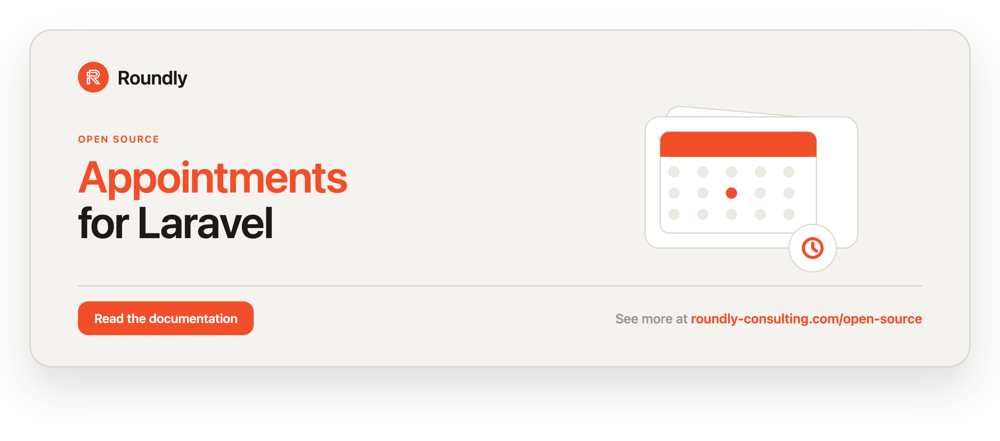

<!-- roundly-hero:start -->
<p align="center">
  <a href="https://roundly-consulting.com/open-source/docs/appointments-for-laravel?utm_source=github&utm_medium=readme&utm_campaign=open-source&utm_content=appointments-for-laravel">
    
  </a>
</p>
<!-- roundly-hero:end -->

# Appointments for Laravel

A scheduling toolkit for Laravel: create appointments with durations, end times, and time
zones; attach participants of any Eloquent model via a polymorphic relationship; detect
double-bookings; drive a guarded status lifecycle; generate recurring series; and export
standards-compliant calendar (`.ics`) files. Built on a native service provider, it also
builds on the roundly-consulting provider packages for venue geolocation, guest contacts,
post-visit reviews, and a booking-approval workflow (see **Integrates with** below).

## Requirements

- PHP `^8.4`
- Laravel `^12.0` or `^13.0`

## Installation

Install the package via Composer:

```bash
composer require roundly-consulting/appointments-for-laravel
```

Publish and run the migrations:

```bash
php artisan vendor:publish --tag="appointments-migrations"
php artisan migrate
```

The package does **not** load its migrations automatically — publishing them is required, and
`php artisan migrate` alone will not create the tables. Once published, the migrations are yours:
they live in your `database/migrations` directory and run in the order they were published
(appointments, then participants, then the location columns).

Optionally publish the config file:

```bash
php artisan vendor:publish --tag="appointments-config"
```

Status, role, and frequency labels come from the `enums-for-laravel` `Helpers` trait
(`readable()` / `labels()` / `options()`), so there are no language files to publish — override
labels through the enums translation seam instead.

## Configuration

The published config file lives at `config/appointments.php`:

```php
return [
    'model' => Appointment::class,
    'participant' => Participant::class,
    'table_names' => [
        'appointments' => 'appointments',
        'participants' => 'appointment_participants',
    ],
    'timezone' => null,
    'default_duration_minutes' => 60,
    'prevent_conflicts' => false,
    'recurrence' => [
        'max_occurrences' => 365,
    ],
    'reviews' => [
        'verified_attendance_resolver' => DatabaseVerifiedAttendanceResolver::class,
        'require_verified_attendance' => false,
    ],
    'approvals' => [
        'enforce_transitions' => false,
    ],
];
```

| Key | Type | Default | Purpose |
|---|---|---|---|
| `model` | `class-string` | `RoundlyConsulting\Appointments\Models\Appointment` | The Eloquent model used for appointments. Point it at your own subclass to customise behaviour. |
| `participant` | `class-string` | `RoundlyConsulting\Appointments\Models\Participant` | The Eloquent model used for appointment participants. |
| `table_names.appointments` | `string` | `appointments` | Table name for appointments. |
| `table_names.participants` | `string` | `appointment_participants` | Table name for participants. |
| `timezone` | `?string` | `null` | Default timezone stored on an appointment. `null` falls back to `config('app.timezone')`. |
| `default_duration_minutes` | `int` | `60` | Duration applied when none is supplied, used to derive `ends_at` from `starts_at`. |
| `prevent_conflicts` | `bool` | `false` | When `true`, creating or rescheduling throws on an overlapping booking for a participant. Can also be enabled per call. |
| `recurrence.max_occurrences` | `int` | `365` | Hard cap on the number of occurrences a recurring series may expand to. |
| `reviews.verified_attendance_resolver` | `class-string` | `DatabaseVerifiedAttendanceResolver` | Resolver that decides whether a review is verified (default: author is a participant of a Completed appointment). |
| `reviews.require_verified_attendance` | `bool` | `false` | When `true`, `review()` throws for an unverified author instead of storing an unverified review. |
| `approvals.enforce_transitions` | `bool` | `false` | When `true`, the approval status-sync listener respects the appointment transition matrix (a mapped-but-illegal move is skipped). |

The effective configuration is summarised in Laravel's `about` command:

```bash
php artisan about --only=appointments
```

## Usage

### Creating an appointment (fluent builder)

The `Appointments` facade exposes a fluent builder — the recommended API:

```php
use RoundlyConsulting\Appointments\Enums\ParticipantRole;
use RoundlyConsulting\Appointments\Facades\Appointments;

$appointment = Appointments::for('Project kickoff')
    ->startingAt('2026-07-01 17:30', timezone: 'Europe/Bratislava')
    ->lasting(90)                       // minutes; or ->until('2026-07-01 19:00')
    ->describedAs('The best chicken wings ever!')
    ->withMeta(['location' => 'My house'])
    ->withParticipant($host, ParticipantRole::Organiser, ['is_host' => true])
    ->withParticipant($guest)
    ->preventConflicts()                // opt-in double-booking guard for this call
    ->create();
```

### Creating an appointment (typed DTO + action)

For programmatic callers, build an `AppointmentData` and run the action:

```php
use Carbon\CarbonImmutable;
use RoundlyConsulting\Appointments\Actions\CreateAppointmentAction;
use RoundlyConsulting\Appointments\DataTransferObjects\AppointmentData;
use RoundlyConsulting\Appointments\DataTransferObjects\ParticipantData;
use RoundlyConsulting\Appointments\Enums\ParticipantRole;

$appointment = app(CreateAppointmentAction::class)->execute(new AppointmentData(
    name: 'Project kickoff',
    startsAt: CarbonImmutable::parse('2026-07-01 17:30'),
    durationMinutes: 90,
    participants: [
        new ParticipantData($host, ParticipantRole::Organiser),
        new ParticipantData($guest),
    ],
));
```

Instants are stored in UTC; the appointment's `timezone` drives local display:

```php
$appointment->startsAtLocal();   // CarbonImmutable in the appointment's timezone
$appointment->endsAtLocal();
$appointment->duration();        // CarbonInterval
$appointment->durationInMinutes();
```

### Duration and end time

Provide a duration (`lasting()` / `durationMinutes`) or an explicit end (`until()` /
`ends_at`). When only one is given the other is derived; when neither is given the
`default_duration_minutes` config value is used.

### Status lifecycle

Status is a guarded state machine. Illegal transitions throw
`InvalidStatusTransitionException`; legal ones persist and fire `AppointmentStatusChanged`.

```php
use RoundlyConsulting\Appointments\Enums\Status;

$appointment->confirm();    // pending → confirmed
$appointment->cancel();     // pending/confirmed → cancelled
$appointment->complete();   // confirmed → completed
$appointment->decline();    // pending → declined
$appointment->markNoShow(); // confirmed → no_show

$appointment->status->label();  // "Confirmed" (from the enums Helpers trait)
$appointment->status->color();  // a colour token for UI badges
Status::options();               // value/label option DTOs for a <select>
Status::validationRule();        // "in:pending,confirmed,cancelled,completed,declined,no_show"
```

Allowed transitions:

| From | To |
|---|---|
| `pending` | `confirmed`, `declined`, `cancelled` |
| `confirmed` | `completed`, `cancelled`, `no_show` |
| `cancelled`, `completed`, `declined`, `no_show` | _(final)_ |

### Conflict detection

With `prevent_conflicts` enabled (globally or per call), creating or rescheduling an
appointment that overlaps an existing booking for any participant throws
`SchedulingConflictException`, which carries the conflicting appointments. Touching ranges
(one ends exactly when the next begins) do not conflict; cancelled and declined appointments
are ignored.

```php
use RoundlyConsulting\Appointments\Support\ConflictDetector;

$conflicts = app(ConflictDetector::class)->forParticipant($user, $start, $end);
```

### Rescheduling

```php
use Carbon\CarbonImmutable;
use RoundlyConsulting\Appointments\Facades\Appointments;

Appointments::reschedule($appointment, CarbonImmutable::parse('2026-07-02 10:00'), durationMinutes: 60);
// fires AppointmentRescheduled
```

### Recurring appointments

```php
use RoundlyConsulting\Appointments\DataTransferObjects\RecurrenceData;
use RoundlyConsulting\Appointments\Enums\Frequency;
use RoundlyConsulting\Appointments\Facades\Appointments;

$series = Appointments::for('Weekly standup')
    ->startingAt('2026-07-06 09:00')
    ->lasting(30)
    ->recurring(new RecurrenceData(Frequency::Weekly, count: 8, byWeekday: [1])) // Mondays
    ->createRecurring();
```

Each occurrence is materialised as its own appointment, linked by a shared `recurrence_group`
UUID. Recurrence supports `daily`/`weekly`/`monthly` frequencies, an `interval`, a `count` or
`until` bound, and `byWeekday` filtering. Expansion is capped by `recurrence.max_occurrences`.

### Querying

Scopes on the appointment model:

```php
use RoundlyConsulting\Appointments\Enums\Status;
use RoundlyConsulting\Appointments\Models\Appointment;

Appointment::query()->upcoming()->forParticipant($user)->ordered()->get();
Appointment::query()->between($from, $to)->get();
Appointment::query()->overlapping($start, $end)->get();
Appointment::query()->withStatus(Status::Confirmed, Status::Completed)->get();
Appointment::query()->past()->get();
```

Add the `HasAppointments` trait to any host model to expose its appointments:

```php
use RoundlyConsulting\Appointments\Concerns\HasAppointments;

class User extends Authenticatable
{
    use HasAppointments;
}

$user->appointments()->upcoming()->get();   // appointments the user takes part in
$user->appointmentParticipations;            // the participant rows
```

### Calendar (ICS) export

Generate RFC 5545 calendar text for one appointment or a collection — the package stays
HTTP-free, so you decide how to deliver it:

```php
use RoundlyConsulting\Appointments\Support\Ics\IcsGenerator;

$ics = $appointment->toIcs();
$ics = app(IcsGenerator::class)->forCollection($user->appointments()->get());

return response($appointment->toIcs(), 200, [
    'Content-Type' => 'text/calendar; charset=utf-8',
    'Content-Disposition' => 'attachment; filename="appointment.ics"',
]);
```

### Relationships

```php
$appointment->participants;  // HasMany<Participant>
$participant->appointment;   // BelongsTo<Appointment>
$participant->participant;   // MorphTo — the underlying entity (e.g. a User)
```

Both models use soft deletes, so deleting an appointment or participant retains the row with a
`deleted_at` timestamp.

### Events

| Event | Dispatched when |
|---|---|
| `RoundlyConsulting\Appointments\Events\AppointmentCreated` | an appointment is created |
| `RoundlyConsulting\Appointments\Events\AppointmentUpdated` | an appointment is updated |
| `RoundlyConsulting\Appointments\Events\AppointmentRescheduled` | an appointment is rescheduled (carries `$previousStartsAt`) |
| `RoundlyConsulting\Appointments\Events\AppointmentStatusChanged` | a status transition occurs (carries `$from` and `$to`) |
| `RoundlyConsulting\Appointments\Events\ParticipantCreated` | a participant is created |
| `RoundlyConsulting\Appointments\Events\ParticipantUpdated` | a participant is updated |
| `RoundlyConsulting\Appointments\Events\ParticipantDeleted` | a participant is deleted |

## Integrates with

Appointments hard-requires five roundly-consulting provider packages and wires them into the
bundled `Appointment` model. If you swap the model via `config('appointments.model')`, extend
the packaged model — the traits (`HasLocation`, `HasContacts`, `HasReviews`, `RequiresApproval`)
come with it.

| Provider | What it adds |
|---|---|
| `package-toolkit-for-laravel` | The package's service provider, publish groups and `php artisan about --only=appointments` section, plus model resolution from config. |
| `enums-for-laravel` | `Status` / `ParticipantRole` / `Frequency` gain `values()`/`labels()`/`options()`/`validationRule()`/`readable()`. |
| `geolocation-for-laravel` | Venue coordinates, a `withinRadius` scope, a distance helper, and an ICS `GEO` line. |
| `contacts-for-laravel` | Guest/booking email & phone contacts and ICS `ATTENDEE`/`ORGANIZER` `mailto:` lines. |
| `approvals-for-laravel` | A booking-approval workflow that drives the appointment status. |
| `reviews-for-laravel` | Post-visit reviews and rating summaries, gated by verified attendance. |

### Venue location (geolocation)

```php
use RoundlyConsulting\Geolocation\DataTransferObjects\Coordinates;

$appointment = Appointments::for('Clinic visit')
    ->startingAt('2026-07-01 09:00')
    ->located(51.5074, -0.1278, 'Clinic A')   // latitude, longitude, venue name
    ->create();

$appointment->coordinates;                     // Coordinates value object (or null)
$appointment->distanceFrom(new Coordinates(48.8566, 2.3522)); // kilometres, or null

Appointment::query()->withinRadius(new Coordinates(51.5074, -0.1278), 10)->get();
```

The ICS export prefers the first-class `location` column (falling back to `meta.location`) and
emits a `GEO:lat;lng` line when coordinates are present.

### Guest contacts (contacts)

```php
$appointment = Appointments::for('Guest booking')
    ->startingAt('2026-07-01 09:00')
    ->withContactEmail('guest@example.com')
    ->withContactPhone('+441234567890')
    ->create();

$appointment->primaryEmail()?->value;          // "guest@example.com"
$appointment->addEmail('other@example.com');
```

A participant (or the appointment) that exposes a primary email upgrades its ICS line to
`ATTENDEE;CN="…":mailto:…`; the appointment's booking contact becomes the calendar `ORGANIZER`.

### Booking approval workflow (approvals)

Opt a booking into confirmation sign-off. The appointment is created `pending` and a
`SyncAppointmentStatusFromApproval` listener moves it as the approval request resolves:
Approved → `confirmed`, Rejected → `declined`, Cancelled/Expired → `cancelled`.

```php
use RoundlyConsulting\Approvals\Enums\ApprovalRule;
use RoundlyConsulting\Approvals\Facades\Approvals;

$appointment = Appointments::for('Booking request')
    ->startingAt('2026-07-01 09:00')
    ->requireApprovalFrom([$organiser, $clinician], ApprovalRule::Quorum, quorum: 1)
    ->create();

Approvals::for($appointment)->as($organiser)->approve();   // → confirmed
```

Staged pipelines and named workflow presets are supported too:

```php
use RoundlyConsulting\Approvals\DataTransferObjects\StageDefinition;

Appointments::for('Two-desk booking')
    ->startingAt('2026-07-01 09:00')
    ->approvalStages([
        new StageDefinition([$reception]),
        new StageDefinition([$clinician]),
    ])
    ->create();

Appointments::for('Preset booking')
    ->startingAt('2026-07-01 09:00')
    ->approvalWorkflow('clinic')                 // config('approvals.workflows.clinic')
    ->approvalStageApprovers([[$reception], [$clinician]])
    ->create();
```

Approver models use the approvals `GivesApprovals` trait. The `appointments:expire-approvals`
command lapses expired decisions.

### Post-visit reviews (reviews)

Appointments are reviewable. A review by a participant of a Completed appointment is stamped
verified; anyone else stays unverified (or is rejected when
`reviews.require_verified_attendance` is on). Aggregates count approved reviews only.

```php
$review = $appointment->review($attendee)->rating(5)->content('Great')->create();

$appointment->averageRating();
$appointment->ratingSummary();          // RatingSummary DTO
$appointment->approvedReviewsCount();
```

Author models use the reviews `CanReview` trait.

## Testing

```bash
composer test
```

## Changelog

Please see [CHANGELOG](CHANGELOG.md) for more information on what has changed recently.

## License

The MIT License (MIT). Please see [LICENSE](LICENSE.md) for more information.
